# SprintMate AI

## Takım İsmi
Grup 57

## Takım Rolleri
* **Büşra KAYA:** Scrum Master
* **Berk Yücedağ:** Product Owner
* **Petek İrem Hızlı:** Developer
* **Muhammed Ali Balcı:** Developer

*(Not: Ekibimiz 4 kişiden oluşmaktadır. Product Owner ve Scrum Master rollerindeki takım üyeleri de proje yönetimi süreçlerinin yanı sıra aktif geliştirme sürecine dahil olmaktadır.)*

## Ürün İsmi
SprintMate AI

## Ürün Açıklaması
SprintMate AI, yarışma şartnamelerini analiz ederek takımlara proje fikri, backlog ve sprint planı oluşturan yapay zeka destekli bir planlama asistanıdır. Bu proje, bootcamp ve yarışma ekiplerinin uzun şartnameleri hızlıca anlamasını, kritik teslimleri kaçırmamasını ve seçilen proje fikrini uygulanabilir bir sprint planına dönüştürmesini sağlar.

## Ürün Özellikleri
* **PDF / Doküman Yükleme:** Kullanıcılar yarışma şartnamesi, kılavuz, brief veya proje dökümanını uygulamaya yükler.
* **Kritik Bilgi Çıkarımı:** Sistem metni işleyerek teslim tarihi, puanlama kriterleri, zorunlu kurallar, yasaklar ve dikkat noktalarını listeler.
* **Proje Fikri Önerici:** Şartnameye tam uygun, yapılabilir ve yenilikçi proje fikirleri önerilir.
* **Product Backlog & User Story Üretimi:** Seçilen fikre göre özellikler, görevler, öncelikler belirlenir ve user story listesi çıkarılır.
* **Sprint Planlayıcı:** Üretilen görevler 3 sprintlik veya kullanıcının seçtiği süreye göre mantıklı bir şekilde bölünür.
* **Risk Analizi:** Kapsam büyüklüğü, teknik risk, zaman riski ve demo riski gibi maddeler analiz edilerek önceden çıkarılır.
* **Dokümantasyon:** Proje için GitHub README, ürün açıklaması ve final demo anlatısı taslak olarak üretilir.

## Hedef Kitle
* **Bootcamp takımları:** Brief veya kılavuzu analiz edip sprint planı oluşturmak ve hızlı yön belirlemek isteyen ekipler.
* **Hackathon ekipleri:** Kısa sürede fikir seçmek ve MVP kapsamını netleştirmek isteyen yarışmacılar.
* **TEKNOFEST / Yarışma takımları:** Şartnamedeki kritik kuralları, teslimleri ve puan kriterlerini görmek isteyen projeciler.
* **Üniversite proje ekipleri:** Dönem projesi veya bitirme projesi planını backlog’a çevirmek isteyen öğrenciler.
* **Mentorlar / Danışmanlar:** Takımların proje fikirlerini hızlıca değerlendirmek isteyen uzmanlar.

## Product Backlog URL
[Proje GitHub Reposu - Grup 57](https://github.com/busra-kayaa/bootcamp-2026)
*(Ayrıntılı görev dağılımı ve iş listesi repo içerisindeki `docs/product_backlog.md` dosyasında yer almaktadır.)*

---

## 🚀 Proje Kurulumu ve Çalıştırma Talimatları

### 1. Frontend (Arayüz) Kurulumu
SprintMate AI frontend uygulaması, kullanıcıların doküman yüklemesini ve analiz sonuçlarını görüntülemesini sağlayan React, Vite ve TailwindCSS/Lucide React tabanlı modern bir arayüzdür.

* **Klasöre girin:** `cd frontend`
* **Paketleri yükleyin:** `npm install`
* **Geliştirme sunucusunu başlatın:** `npm run dev`
* **Tarayıcıda açın:** `http://localhost:5173`
* **Production Build için:** `npm run build`

> **Not (Geçici Veri Kullanımı):** Backend entegrasyonu tamamlanana kadar, arayüzdeki analiz sonuçları `src/data/mockAnalysis.js` dosyasındaki örnek veriler üzerinden çalışmaktadır.

### 2. Backend (API & Veritabanı) Kurulumu
Projemiz, FastAPI altyapısı ve **Clean Architecture (Temiz Mimari)** prensipleri kullanılarak asenkron yapıda inşa edilmiştir.

* **Klasöre girin:** `cd backend`
* **Sanal ortam oluşturun ve aktif edin (Windows PowerShell):**
  ```powershell
  python -m venv .venv
  .\.venv\Scripts\Activate.ps1
  ```
* **Gereksinimleri yükleyin:** `python -m pip install -r requirements.txt`
* **Çevre değişkenlerini ayarlayın:** `Copy-Item .env.example .env`
* **Veritabanı Tablolarını Oluşturun (Alembic):** `python -m alembic upgrade head`
* **Sunucuyu başlatın:** `uvicorn app.main:app --reload`
* **Health Check Endpoint:** `http://127.0.0.1:8000/health`
* **Swagger API Dokümantasyonu:** `http://127.0.0.1:8000/docs`
* **Testleri çalıştırmak için:** `pytest`

---

## 📌 Sprint 1 Bilgileri (05 Temmuz 2026)

**Sprint Hedefi:** İlk çalışan iskeletin (MVP) ve proje vizyonunun kurulması. Hedeflenen kapsama %100 ulaşıldı.

### 📖 Kullanıcı Hikayeleri (User Stories)
1. Bir yarışma katılımcısı olarak şartname PDF’ini yüklemek istiyorum, böylece önemli kuralları hızlıca görebileyim.
2. Bir takım üyesi olarak şartnameye uygun proje fikirleri görmek istiyorum, böylece fikir aşamasında zaman kaybetmeyeyim.
3. Bir Scrum Master olarak product backlog ve sprint planı almak istiyorum, böylece ekibin iş dağılımını daha hızlı yapabileyim.
4. Bir Product Owner olarak riskleri görmek istiyorum, böylece kapsamı gereğinden fazla büyütmeden karar verebileyim.
5. Bir geliştirici olarak GitHub issue formatında görev almak istiyorum, böylece doğrudan geliştirmeye başlayabileyim.
6. Bir takım üyesi olarak önerilen projelerin artı/eksi ve AI katkısı puanlarını görmek istiyorum, böylece fikirler arasında kolayca seçim yapabileyim.
7. Bir yarışma takımı üyesi olarak README taslağı ve final demo anlatısı almak istiyorum, böylece dokümantasyon süreçlerini hızlandırabileyim.
8. Bir kullanıcı olarak yapay zeka çıktılarının şartnamedeki hangi bölüme dayandığını (kaynak) görmek istiyorum, böylece güvenilirlik sağlayabileyim.

### 📋 Product Backlog
**Proje Yönetimi & Dokümantasyon**
* **Task 1:** GitHub repository klasör yapısının (`frontend`, `backend`, `docs`) oluşturulması.
* **Task 2:** Proje vizyonu, user story'ler ve hedef kitlenin belgelenmesi.
* **Task 3:** Sprint 1 review ve retro toplantılarının yapılıp raporlanması.

**Frontend (Arayüz)**
* **Task 4:** Temel frontend projesinin başlatılması ve proje iskeletinin kurulması.
* **Task 5:** Kullanıcının şartname PDF'ini yükleyebileceği veya metin girebileceği basit ekran tasarımının kodlanması.
* **Task 6:** Backend'den gelen analiz sonuçlarının ekranda düzgün bir şekilde gösterileceği arayüz bileşenlerinin oluşturulması.

**Backend & AI Pipeline**
* **Task 7:** API altyapısının kurularak backend projesinin başlatılması ve PDF/metin okuma endpoint'inin yazılması.
* **Task 8:** Yapay zekaya gitmeden önce veriyi temizlemek ve düzenlemek için metin ön işleme (text preprocessing) adımlarının eklenmesi.
* **Task 9:** Uygulamanın hızlı çalışabilmesi için asenkron backend mimarisinin tasarlanması.
* **Task 10:** Şartname analizi ve fikir üretme gibi temel AI görevleri için ilk prompt tasarımlarının yapılıp test edilmesi.
* **Task 11:** RAG (Retrieval-Augmented Generation) altyapısı için dokümanları parçalama (chunking) ve aranabilir hale getirme (embedding) hazırlıklarının yapılması.
* **Task 12:** Seçilecek yapay zeka modelinin projeye en uygun cevapları üretebilmesi için gerekli test ve iyileştirmelerin yapılması.

---

### 🔍 Sprint 1 - Review Toplantısı
* **Tarih:** 04 Temmuz 2026
* **Tamamlanan İşler:**
  - Ürün vizyonu, User Stories ve 12 maddelik Product Backlog oluşturuldu.
  - React tabanlı basit PDF yükleme arayüzü çıkarıldı.
  - FastAPI üzerinde metin/PDF alma ve NLP normalizasyon endpoint'i yazıldı.
  - Requirement ve Idea agent'ları için ilk prompt denemeleri belgelendi.
* **Tamamlanamayan İşler veya Karşılaşılan Sorunlar (Blockers):**
  - Sprint 1 kapsamında tamamlanamayan iş veya süreci tıkayan herhangi bir blocker yaşanmamıştır.

### 🔄 Sprint 1 - Retrospective Toplantısı
* **Tarih:** 04 Temmuz 2026
* **Neleri İyi Yaptık?**
  - Ekip içi görev dağılımını (Scrum Master, Product Owner, Developer) hızlıca benimsedik ve 5 Temmuz deadline'ına tüm temel doküman ve repo altyapısını yetiştirmeyi başardık.
* **Neleri Geliştirmeliyiz?**
  - Backend ve AI model entegrasyonlarını yerleştirirken teknik detayları repoda daha sık güncellemeli ve GitHub commit sayılarını artırmalıyız. Kodları lokalde tutup toplu pushlamak yerine parça parça gönderme alışkanlığı kazanmalıyız.
* **Aksiyon Planı:**
  - **Teknik:** Sprint 2'de asenkron LLM çağrılarına ve RAG altyapısının kodlanmasına başlanacak.
  - **Süreç:** Takım üyeleri yazdıkları kodları ve dokümanları "Done" aşamasına çekerken günlük olarak GitHub'a commit atacak.

---

### 📸 Görsel Kanıtlar (Sprint 1)

<details>
<summary><b>👉 Sprint 1 Görsellerini Görmek İçin Tıklayın</b></summary>

<br>

**1. Ürün Durumu (Çalışan MVP İskeleti)**
*Frontend Arayüzü:*


*Başarılı Analiz Sonucu:*


*FastAPI Backend Swagger Dokümantasyonu:*


**2. Sprint Board (Görev Takip Panosu)**
*Grup 57 - Sprint 1 Jira Board:*


**3. Daily Scrum (Günlük Toplantı ve İletişim)**
*Ekip içi senkronizasyon, görev dağılımı ve toplantı özetleri:*

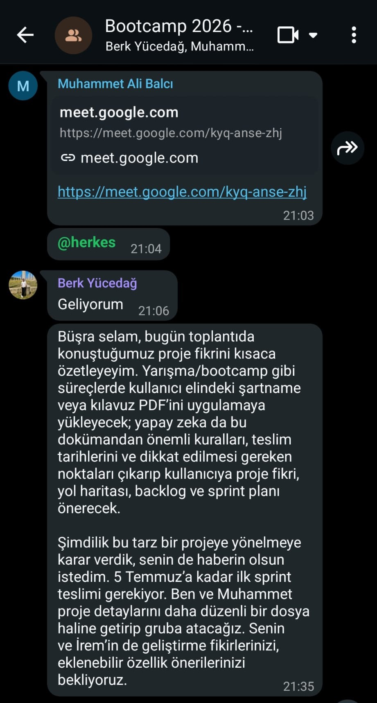
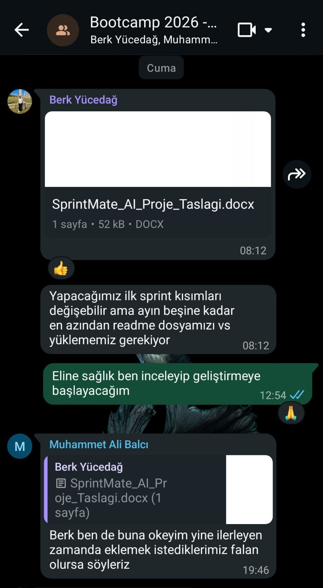
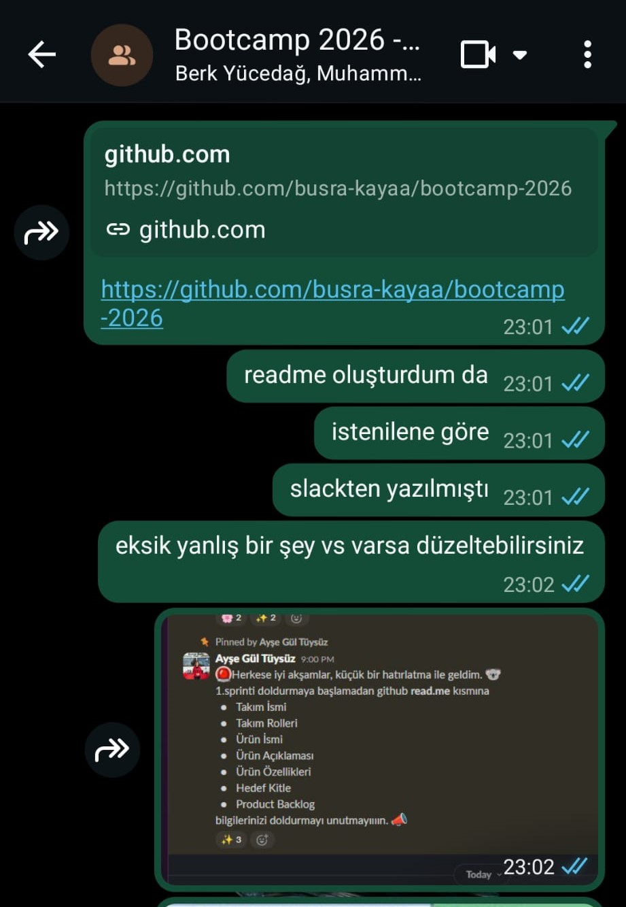

*02.07.2026 Tarihli Sprint Planlama Meet Toplantısı Kaydı:*
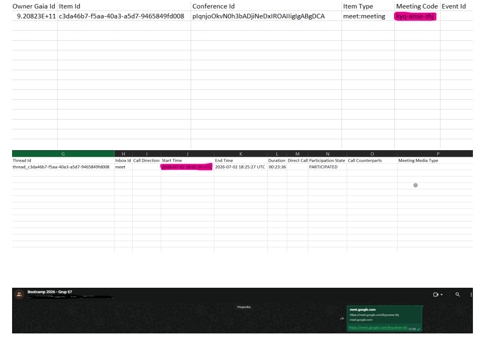

</details>

---

## 📌 Sprint 2 Bilgileri (19 Temmuz 2026)

**Sprint Hedefi:** Asenkron PostgreSQL veritabanı altyapısının ayağa kaldırılması, API tarafında Clean Architecture (Temiz Mimari) entegrasyonu, arayüzün (Frontend) baştan aşağı yenilenmesi ve AI prompt mimarisinin sisteme dahil edilmesi.

### 📖 Kullanıcı Hikayeleri (User Stories)
9. Bir geliştirici olarak veritabanı tablolarının asenkron bir şekilde otomatik oluşmasını istiyorum, böylece veri modellerini manuel olarak yönetmekle zaman kaybetmeyeyim.
10. Bir kullanıcı olarak analiz edilen şartnamenin genel özetini, kritik tarihlerini ve zorunlu kurallarını tek ekranda görmek istiyorum, böylece detaylarda kaybolmayayım.
11. Bir takım üyesi olarak şartnameye en uygun proje fikirlerini ve AI katkı seviyelerini karşılaştırmalı olarak görmek istiyorum, böylece doğru projeyi seçebileyim.
12. Bir Product Owner olarak önceden önlem alınması gereken noktaları risk analizi tablosunda görmek istiyorum, böylece projeyi daha güvenli yönetebileyim.
13. Bir geliştirici olarak backend projesinin katmanlı bir mimaride olmasını istiyorum, böylece kodlarımı daha düzenli ve ölçeklenebilir şekilde geliştirebileyim.

### 📋 Product Backlog & Tamamlanan Görevler
**Backend, Mimari & Veritabanı**
* **Task 13:** FastAPI asenkron bağlantısı için gerekli kütüphanelerin sanal ortama (`.venv`) dahil edilmesi.
* **Task 14:** Backend temiz mimari (Clean Architecture) klasör iskeletinin (`api/routes`, `services`, `repositories`, vb.) oluşturulması ve entegrasyonu.
* **Task 15:** Veritabanı bağlantı kontrollerinin yapılması ve `models` altında PostgreSQL tablolarını temsil eden SQLAlchemy modellerinin oluşturulması.
* **Task 16:** Asenkron veritabanı entegrasyonu ve Alembic migrasyonlarının tamamlanması; test ve sağlık (`/health`) endpointlerinin aktif edilmesi. 
* **Task 17:** Gelişmiş prompt mimarisinin tasarlanarak klasörlere ayrılması ve backend ile entegre edilmesi.

**Frontend & UI Geliştirmeleri**
* **Task 18:** SprintMate AI frontend arayüzünün (React, Vite, Lucide React) modern tasarıma uygun şekilde tamamen yenilenmesi.
* **Task 19:** Kullanıcının sürükle-bırak yöntemiyle doküman yükleyebileceği alanların (PDF, TXT, DOC, DOCX) oluşturulması ve dosya formatı doğrulamalarının yapılması.
* **Task 20:** "Şartname analiz sonuçları", "Proje önerileri" ve "Risk analizi" bileşenlerinin arayüze eklenmesi.
* **Task 21:** Backend API uçları tamamlanana kadar arayüz geliştirmesinin kesintiye uğramaması adına verilerin geçici bir mock dosyasından (`mockAnalysis.js`) çekilmesi.
* **Task 22:** Frontend dokümantasyonunun (`README.md`) detaylıca yazılarak güncellenmesi.

### 🔍 Sprint 2 - Review Toplantısı
* **Tarih:** 19 Temmuz 2026
* **Tamamlanan İşler:**
  - Asenkron veritabanı kurulum süreçleri başarıyla aşıldı, modeller ve tablolar Alembic üzerinden veritabanına işlendi.
  - Kod kalitesini artırmak adına Backend tarafında "Clean Architecture" standartlarına geçildi ve yapılandırma tamamlandı.
  - Frontend kullanıcı arayüzü sıfırdan yazılarak responsive ve estetik bir forma kavuşturuldu; mock verilerle analiz sonuçları dinamikleştirildi.
  - Takım içi GitHub PR (Pull Request) kültürü aktif olarak kullanıldı.
* **Tamamlanamayan İşler veya Karşılaşılan Sorunlar (Blockers):**
  - Sprint 2 kapsamında bloklayıcı bir sorun yaşanmamış, planlanan tüm hedeflere ulaşılmıştır.

### 🔄 Sprint 2 - Retrospective Toplantısı
* **Tarih:** 19 Temmuz 2026
* **Neleri İyi Yaptık?**
  - Ekip içi iletişim ve teknik dayanışma en üst seviyedeydi. Günlük toplantılar (Daily Scrum) ve WhatsApp koordinasyonu sayesinde herkes diğerinin eksiğini kapattı (Örn: Mock datalarla frontend'in bloklanmadan ilerlemesi).
  - Klasör yapılarının standartlaşması ve ortam (path) hatalarının takımca analiz edilerek çözülmesi önemli bir teknik kazanım oldu.
* **Aksiyon Planı:**
  - Bir sonraki sprintte `mockAnalysis.js` içerisindeki statik veriler kaldırılarak gerçek FastAPI backend uçlarıyla (gerçek LLM çıktılarıyla) doğrudan iletişim sağlanacak.
  - RAG altyapısı için vektör tabanlı veritabanı testlerine başlanacak.

### 📸 Görsel Kanıtlar (Sprint 2)

<details>
<summary><b>👉 Sprint 2 Görsellerini Görmek İçin Tıklayın</b></summary>

<br>

**1. Ürün Durumu (Backend & Veritabanı)**
*Backend Health Check (200 OK) Terminal Çıktısı:*
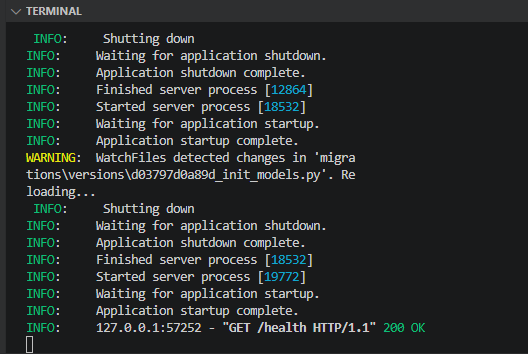

*Swagger UI Üzerinde Health API Başarılı Yanıtı:*
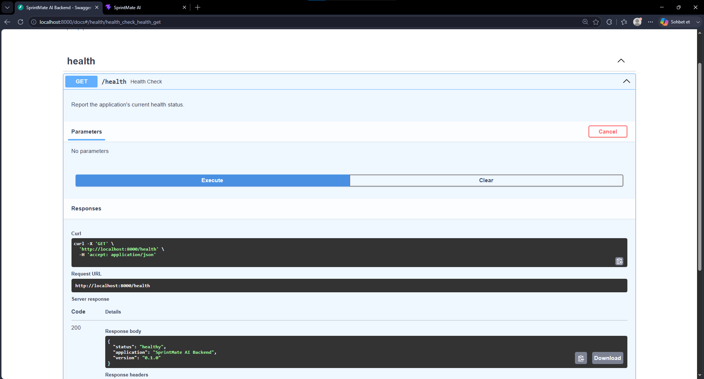

*pgAdmin Üzerinde Başarıyla Oluşturulan Tablolar:*
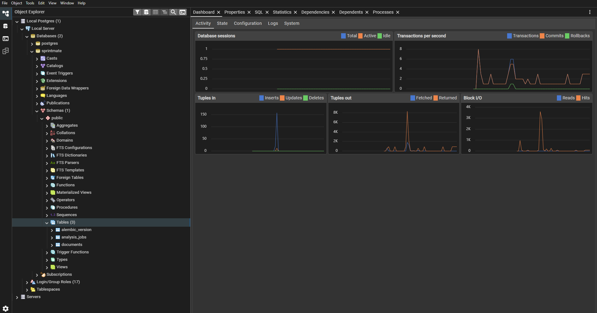

**2. Ürün Durumu (Frontend & Arayüz Entegrasyonları)**
*Doküman Yükleme ve Başlangıç Ekranları:*
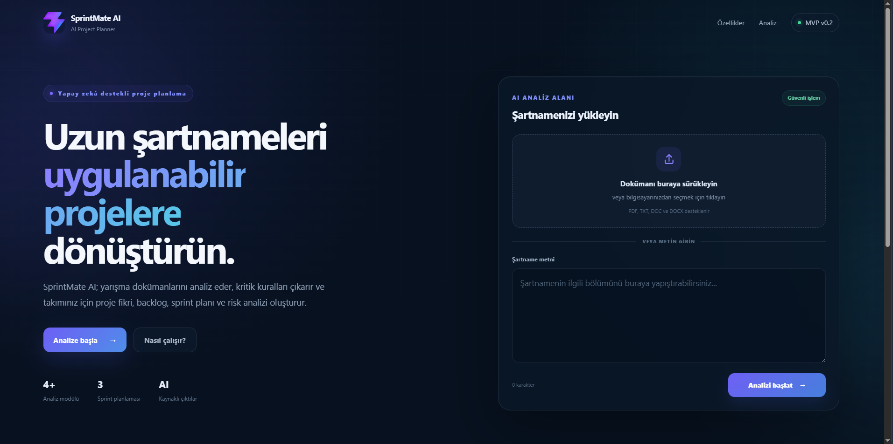
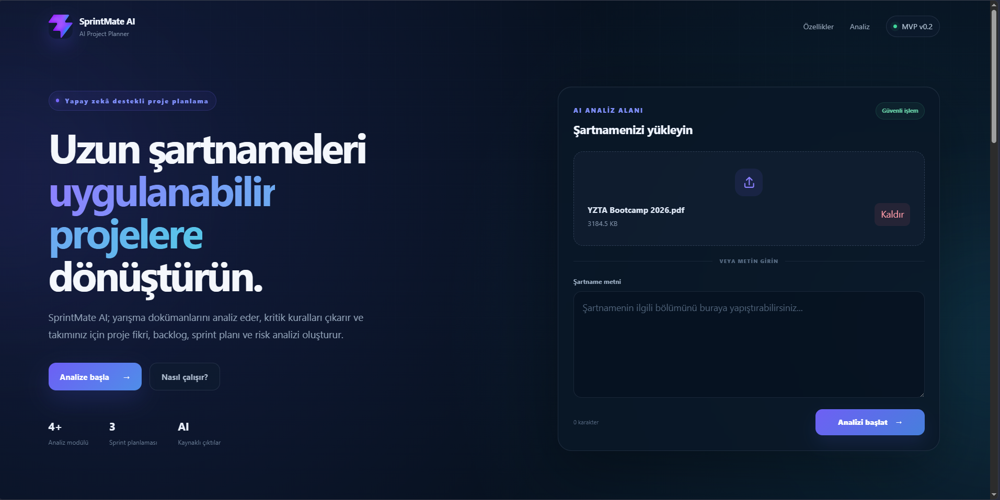
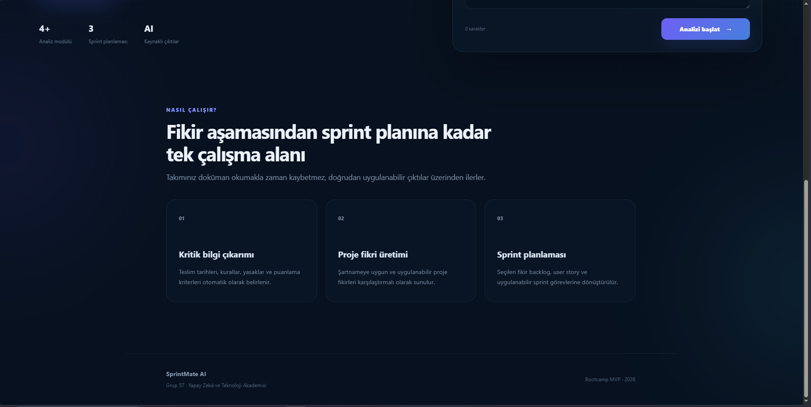

*AI Şartname Analiz Sonuçları (Özet, Tarihler, Kurallar):*
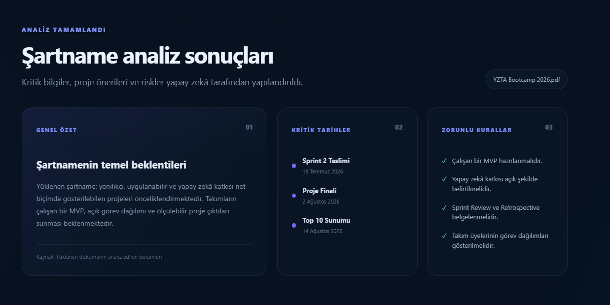

*AI Proje Fikri Önerileri:*
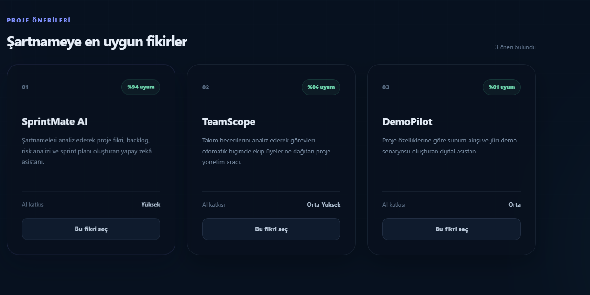

*AI Risk Analizi (Kapsam, Gecikme, Kaynak Doğruluğu):*
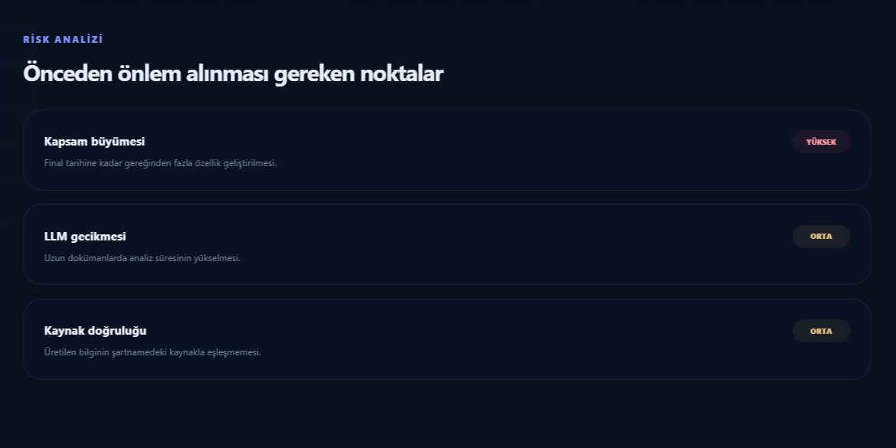

**3. Sprint Board (Görev Takip Panosu)**
*Jira üzerinde Sprint 2 görevlerinin (To Do, In Progress, In Review, Done) güncel durumu:*
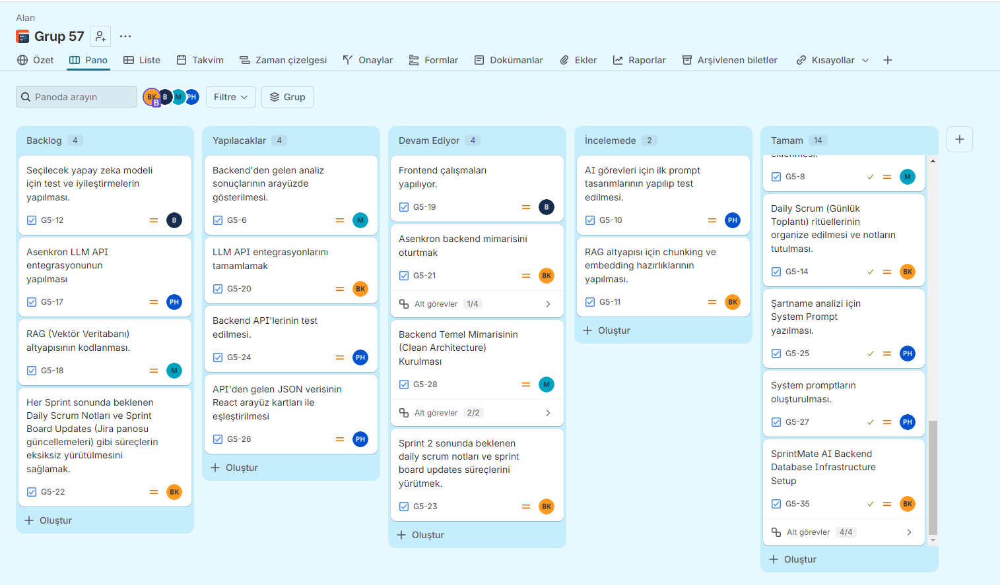

**4. Daily Scrum (Günlük Toplantı ve İletişim)**
*Ekip içi görev dağılımı, Jira senkronizasyonu, PR bildirimleri ve anlık yardımlaşma süreçleri:*

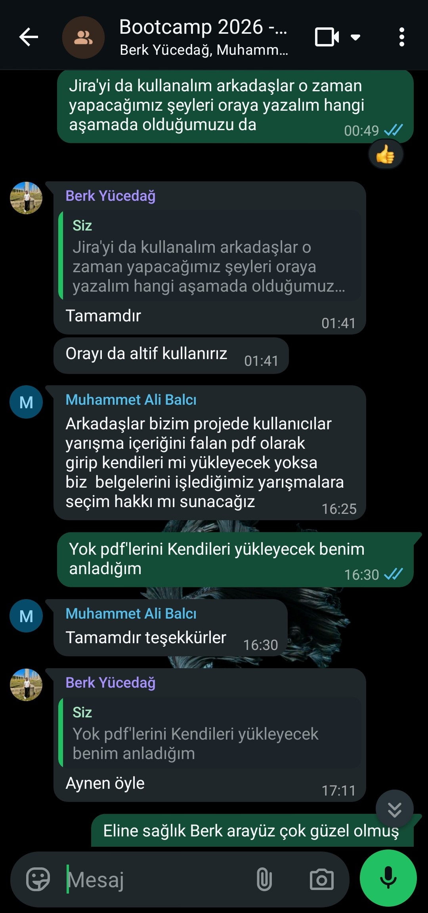
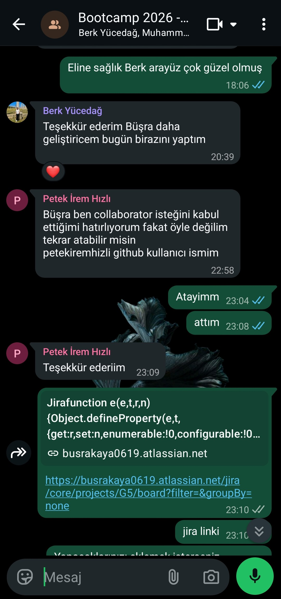
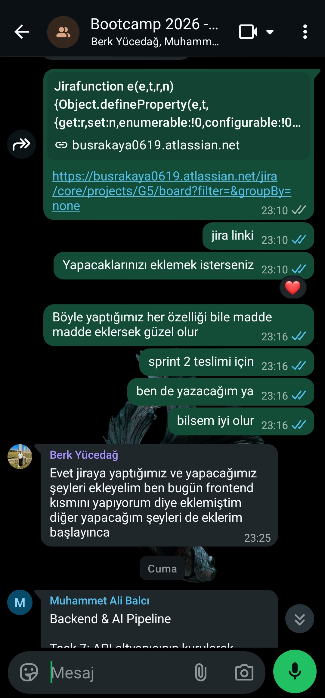
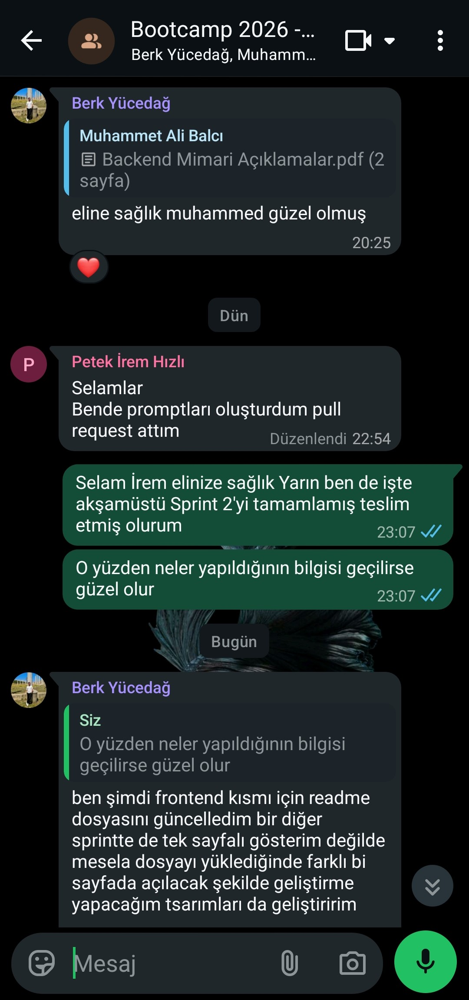
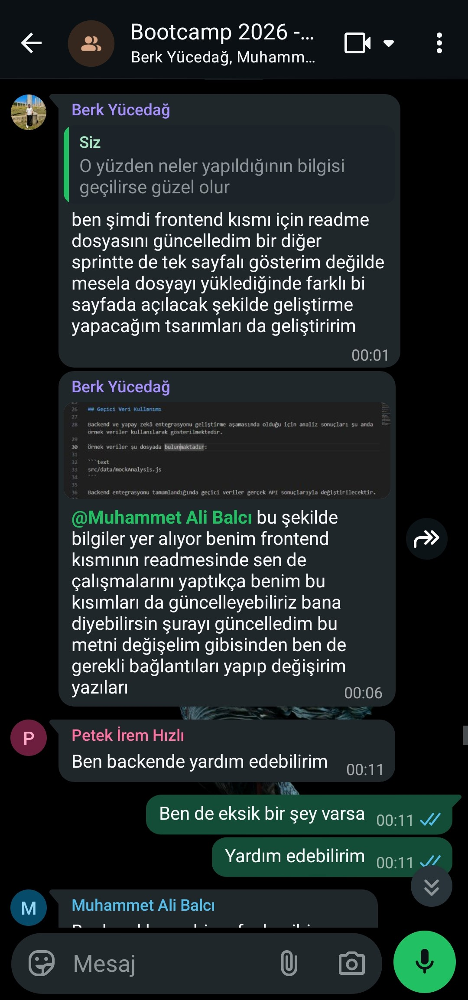
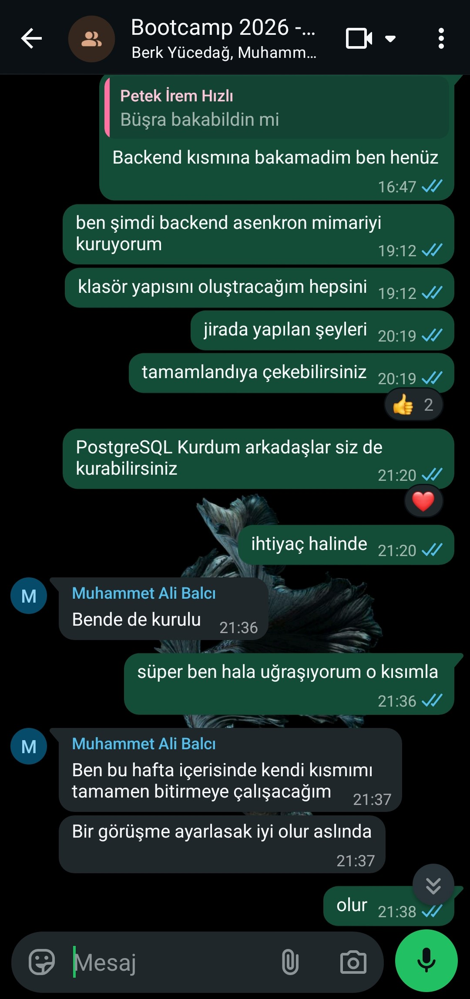

</details>