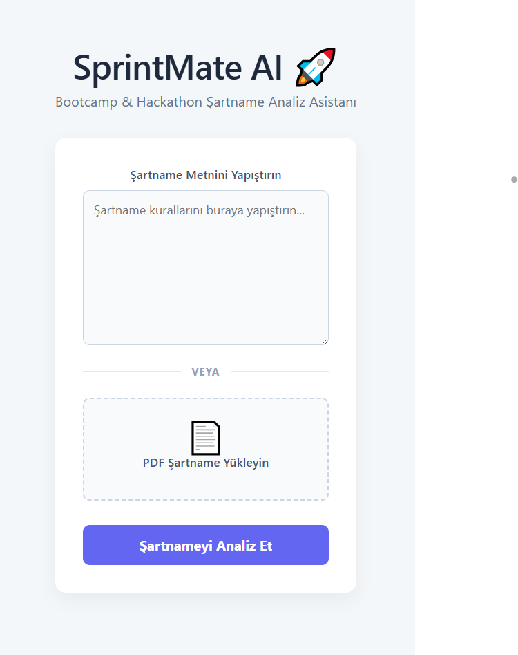
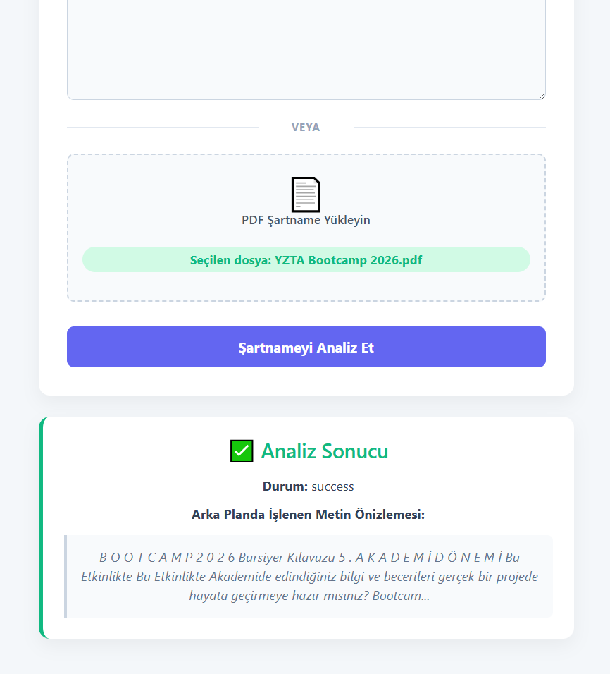
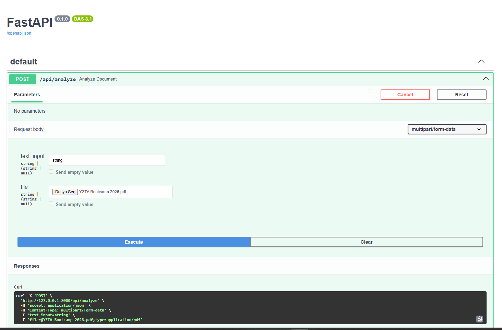
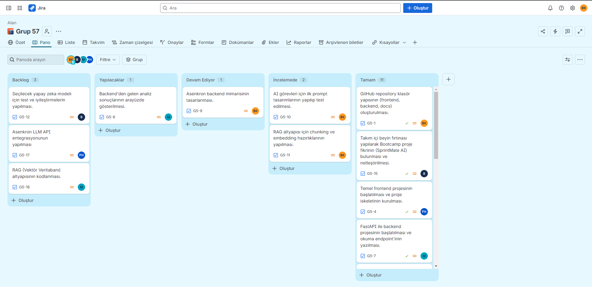

# SprintMate AI

## Takım İsmi
Grup 57

## Takım Rolleri
* **Büşra KAYA:** Scrum Master
* **Berk Yücedağ:** Product Owner
* **Petek İrem Hızlı:** Developer
* **Muhammed Ali Balcı:** Developer

*(Not: Ekibimiz 4 kişiden oluşmaktadır. Product Owner ve Scrum Master rollerindeki takım üyeleri de proje yönetimi süreçlerinin yanı sıra aktif geliştirme sürecine dahil olmaktadır.)*

## Ürün İsmi
SprintMate AI

## Ürün Açıklaması
SprintMate AI, yarışma şartnamelerini analiz ederek takımlara proje fikri, backlog ve sprint planı oluşturan yapay zeka destekli bir planlama asistanıdır. Bu proje, bootcamp ve yarışma ekiplerinin uzun şartnameleri hızlıca anlamasını, kritik teslimleri kaçırmamasını ve seçilen proje fikrini uygulanabilir bir sprint planına dönüştürmesini sağlar.

## Ürün Özellikleri
* **PDF / Doküman Yükleme:** Kullanıcılar yarışma şartnamesi, kılavuz, brief veya proje dökümanını uygulamaya yükler.
* **Kritik Bilgi Çıkarımı:** Sistem metni işleyerek teslim tarihi, puanlama kriterleri, zorunlu kurallar, yasaklar ve dikkat noktalarını listeler.
* **Proje Fikri Önerici:** Şartnameye tam uygun, yapılabilir ve yenilikçi proje fikirleri önerilir.
* **Product Backlog & User Story Üretimi:** Seçilen fikre göre özellikler, görevler, öncelikler belirlenir ve user story listesi çıkarılır.
* **Sprint Planlayıcı:** Üretilen görevler 3 sprintlik veya kullanıcının seçtiği süreye göre mantıklı bir şekilde bölünür.
* **Risk Analizi:** Kapsam büyüklüğü, teknik risk, zaman riski ve demo riski gibi maddeler analiz edilerek önceden çıkarılır.
* **Dokümantasyon:** Proje için GitHub README, ürün açıklaması ve final demo anlatısı taslak olarak üretilir.

## Hedef Kitle
* **Bootcamp takımları:** Brief veya kılavuzu analiz edip sprint planı oluşturmak ve hızlı yön belirlemek isteyen ekipler.
* **Hackathon ekipleri:** Kısa sürede fikir seçmek ve MVP kapsamını netleştirmek isteyen yarışmacılar.
* **TEKNOFEST / Yarışma takımları:** Şartnamedeki kritik kuralları, teslimleri ve puan kriterlerini görmek isteyen projeciler.
* **Üniversite proje ekipleri:** Dönem projesi veya bitirme projesi planını backlog’a çevirmek isteyen öğrenciler.
* **Mentorlar / Danışmanlar:** Takımların proje fikirlerini hızlıca değerlendirmek isteyen uzmanlar.

## Product Backlog URL
[Proje GitHub Reposu - Grup 57](https://github.com/busra-kayaa/bootcamp-2026)
*(Ayrıntılı görev dağılımı ve iş listesi repo içerisindeki `docs/product_backlog.md` dosyasında yer almaktadır.)*

---

## 📌 Sprint 1 Bilgileri (05 Temmuz 2026)

**Sprint Hedefi:** İlk çalışan iskeletin (MVP) ve proje vizyonunun kurulması. Hedeflenen kapsama %100 ulaşıldı.

### 📖 Kullanıcı Hikayeleri (User Stories)
1. Bir yarışma katılımcısı olarak şartname PDF’ini yüklemek istiyorum, böylece önemli kuralları hızlıca görebileyim.
2. Bir takım üyesi olarak şartnameye uygun proje fikirleri görmek istiyorum, böylece fikir aşamasında zaman kaybetmeyeyim.
3. Bir Scrum Master olarak product backlog ve sprint planı almak istiyorum, böylece ekibin iş dağılımını daha hızlı yapabileyim.
4. Bir Product Owner olarak riskleri görmek istiyorum, böylece kapsamı gereğinden fazla büyütmeden karar verebileyim.
5. Bir geliştirici olarak GitHub issue formatında görev almak istiyorum, böylece doğrudan geliştirmeye başlayabileyim.
6. Bir takım üyesi olarak önerilen projelerin artı/eksi ve AI katkısı puanlarını görmek istiyorum, böylece fikirler arasında kolayca seçim yapabileyim.
7. Bir yarışma takımı üyesi olarak README taslağı ve final demo anlatısı almak istiyorum, böylece dokümantasyon süreçlerini hızlandırabileyim.
8. Bir kullanıcı olarak yapay zeka çıktılarının şartnamedeki hangi bölüme dayandığını (kaynak) görmek istiyorum, böylece güvenilirlik sağlayabileyim.

### 📋 Product Backlog
**Proje Yönetimi & Dokümantasyon**
* **Task 1:** GitHub repository klasör yapısının (`frontend`, `backend`, `docs`) oluşturulması.
* **Task 2:** Proje vizyonu, user story'ler ve hedef kitlenin belgelenmesi.
* **Task 3:** Sprint 1 review ve retro toplantılarının yapılıp raporlanması.

**Frontend (Arayüz)**
* **Task 4:** Temel frontend projesinin başlatılması ve proje iskeletinin kurulması.
* **Task 5:** Kullanıcının şartname PDF'ini yükleyebileceği veya metin girebileceği basit ekran tasarımının kodlanması.
* **Task 6:** Backend'den gelen analiz sonuçlarının ekranda düzgün bir şekilde gösterileceği arayüz bileşenlerinin oluşturulması.

**Backend & AI Pipeline**
* **Task 7:** API altyapısının kurularak backend projesinin başlatılması ve PDF/metin okuma endpoint'inin yazılması.
* **Task 8:** Yapay zekaya gitmeden önce veriyi temizlemek ve düzenlemek için metin ön işleme (text preprocessing) adımlarının eklenmesi.
* **Task 9:** Uygulamanın hızlı çalışabilmesi için asenkron backend mimarisinin tasarlanması.
* **Task 10:** Şartname analizi ve fikir üretme gibi temel AI görevleri için ilk prompt tasarımlarının yapılıp test edilmesi.
* **Task 11:** RAG (Retrieval-Augmented Generation) altyapısı için dokümanları parçalama (chunking) ve aranabilir hale getirme (embedding) hazırlıklarının yapılması.
* **Task 12:** Seçilecek yapay zeka modelinin projeye en uygun cevapları üretebilmesi için gerekli test ve iyileştirmelerin yapılması.

---

### 🔍 Sprint 1 - Review Toplantısı
* **Tarih:** 04 Temmuz 2026
* **Tamamlanan İşler:**
  - Ürün vizyonu, User Stories ve 12 maddelik Product Backlog oluşturuldu.
  - React tabanlı basit PDF yükleme arayüzü çıkarıldı.
  - FastAPI üzerinde metin/PDF alma ve NLP normalizasyon endpoint'i yazıldı.
  - Requirement ve Idea agent'ları için ilk prompt denemeleri belgelendi.
* **Tamamlanamayan İşler veya Karşılaşılan Sorunlar (Blockers):**
  - Sprint 1 kapsamında tamamlanamayan iş veya süreci tıkayan herhangi bir blocker yaşanmamıştır.

### 🔄 Sprint 1 - Retrospective Toplantısı
* **Tarih:** 04 Temmuz 2026
* **Neleri İyi Yaptık?**
  - Ekip içi görev dağılımını (Scrum Master, Product Owner, Developer) hızlıca benimsedik ve 5 Temmuz deadline'ına tüm temel doküman ve repo altyapısını yetiştirmeyi başardık.
* **Neleri Geliştirmeliyiz?**
  - Backend ve AI model entegrasyonlarını yerleştirirken teknik detayları repoda daha sık güncellemeli ve GitHub commit sayılarını artırmalıyız. Kodları lokalde tutup toplu pushlamak yerine parça parça gönderme alışkanlığı kazanmalıyız.
* **Aksiyon Planı:**
  - **Teknik:** Sprint 2'de asenkron LLM çağrılarına ve RAG altyapısının kodlanmasına başlanacak.
  - **Süreç:** Takım üyeleri yazdıkları kodları ve dokümanları "Done" aşamasına çekerken günlük olarak GitHub'a commit atacak.

---

### 📸 Görsel Kanıtlar (Sprint 1)

<b>👉 Sprint 1 Görsellerini Görmek İçin Tıklayın</b>

 

**1. Ürün Durumu (Çalışan MVP İskeleti)**
*Frontend Arayüzü:*

*Başarılı Analiz Sonucu:*

*FastAPI Backend Swagger Dokümantasyonu:*

**2. Sprint Board (Görev Takip Panosu)**
*Grup 57 - Sprint 1 Jira Board:*

**3. Daily Scrum (Günlük Toplantı)**
*(Not: Daily Scrum toplantı ekran görüntüsü buraya eklenecektir.)*

